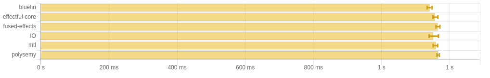

# Versions
- bluefin: 0.0.9.0
- effectful-core: 2.3.1.0
- fused-effects: 1.1.2.3
- base: 4.18.2.1
- mtl: 2.3.1
- polysemy: 1.9.2.0

# Benchmark

## no IO/computation


```
benchmarking bluefin
time                 7.772 μs   (7.683 μs .. 7.842 μs)
                     1.000 R²   (0.999 R² .. 1.000 R²)
mean                 7.717 μs   (7.683 μs .. 7.760 μs)
std dev              142.8 ns   (104.1 ns .. 220.8 ns)
variance introduced by outliers: 17% (moderately inflated)

benchmarking effectful-core
time                 11.72 μs   (11.65 μs .. 11.81 μs)
                     1.000 R²   (1.000 R² .. 1.000 R²)
mean                 11.69 μs   (11.65 μs .. 11.76 μs)
std dev              187.9 ns   (123.2 ns .. 309.6 ns)
variance introduced by outliers: 13% (moderately inflated)

benchmarking fused-effects
time                 3.485 ms   (3.368 ms .. 3.577 ms)
                     0.997 R²   (0.996 R² .. 0.999 R²)
mean                 3.471 ms   (3.437 ms .. 3.507 ms)
std dev              116.0 μs   (88.39 μs .. 158.3 μs)
variance introduced by outliers: 16% (moderately inflated)

benchmarking IO
time                 7.654 μs   (7.573 μs .. 7.777 μs)
                     0.999 R²   (0.998 R² .. 1.000 R²)
mean                 7.699 μs   (7.627 μs .. 7.806 μs)
std dev              281.3 ns   (215.5 ns .. 373.0 ns)
variance introduced by outliers: 45% (moderately inflated)

benchmarking mtl
time                 6.571 μs   (6.519 μs .. 6.620 μs)
                     1.000 R²   (0.999 R² .. 1.000 R²)
mean                 6.587 μs   (6.542 μs .. 6.677 μs)
std dev              200.9 ns   (136.2 ns .. 326.8 ns)
variance introduced by outliers: 37% (moderately inflated)

benchmarking polysemy
time                 1.624 ms   (1.602 ms .. 1.646 ms)
                     0.999 R²   (0.998 R² .. 0.999 R²)
mean                 1.631 ms   (1.618 ms .. 1.660 ms)
std dev              62.53 μs   (42.55 μs .. 85.61 μs)
variance introduced by outliers: 25% (moderately inflated)
```

## light computation


```
benchmarking bluefin
time                 8.519 ms   (8.400 ms .. 8.692 ms)
                     0.998 R²   (0.996 R² .. 0.999 R²)
mean                 8.533 ms   (8.474 ms .. 8.600 ms)
std dev              187.0 μs   (147.6 μs .. 231.5 μs)

benchmarking effectful-core
time                 8.641 ms   (8.440 ms .. 8.790 ms)
                     0.997 R²   (0.995 R² .. 0.999 R²)
mean                 8.603 ms   (8.526 ms .. 8.690 ms)
std dev              213.4 μs   (181.4 μs .. 266.2 μs)

benchmarking fused-effects
time                 12.61 ms   (12.42 ms .. 12.86 ms)
                     0.998 R²   (0.996 R² .. 0.999 R²)
mean                 12.61 ms   (12.51 ms .. 12.74 ms)
std dev              311.6 μs   (232.9 μs .. 388.2 μs)

benchmarking IO
time                 8.615 ms   (8.412 ms .. 8.876 ms)
                     0.997 R²   (0.995 R² .. 0.999 R²)
mean                 8.497 ms   (8.425 ms .. 8.585 ms)
std dev              218.9 μs   (175.5 μs .. 296.6 μs)

benchmarking mtl
time                 8.781 ms   (8.502 ms .. 9.123 ms)
                     0.994 R²   (0.989 R² .. 0.999 R²)
mean                 8.606 ms   (8.529 ms .. 8.748 ms)
std dev              296.5 μs   (213.0 μs .. 492.6 μs)
variance introduced by outliers: 15% (moderately inflated)

benchmarking polysemy
time                 10.61 ms   (10.37 ms .. 10.84 ms)
                     0.996 R²   (0.990 R² .. 0.999 R²)
mean                 10.68 ms   (10.53 ms .. 10.87 ms)
std dev              434.4 μs   (299.0 μs .. 568.3 μs)
variance introduced by outliers: 16% (moderately inflated)
```

## heavy computation


```
benchmarking bluefin
time                 66.63 ms   (65.25 ms .. 68.35 ms)
                     0.999 R²   (0.997 R² .. 1.000 R²)
mean                 67.02 ms   (66.44 ms .. 67.92 ms)
std dev              1.266 ms   (786.8 μs .. 1.951 ms)

benchmarking effectful-core
time                 67.84 ms   (65.32 ms .. 70.42 ms)
                     0.998 R²   (0.995 R² .. 1.000 R²)
mean                 67.79 ms   (66.98 ms .. 68.66 ms)
std dev              1.514 ms   (1.229 ms .. 2.017 ms)

benchmarking fused-effects
time                 73.14 ms   (71.47 ms .. 76.10 ms)
                     0.998 R²   (0.995 R² .. 0.999 R²)
mean                 73.23 ms   (71.96 ms .. 74.58 ms)
std dev              2.279 ms   (1.674 ms .. 3.048 ms)

benchmarking IO
time                 67.71 ms   (66.53 ms .. 68.55 ms)
                     0.999 R²   (0.998 R² .. 1.000 R²)
mean                 67.43 ms   (66.94 ms .. 67.93 ms)
std dev              896.0 μs   (705.1 μs .. 1.164 ms)

benchmarking mtl
time                 66.81 ms   (65.04 ms .. 68.11 ms)
                     0.999 R²   (0.997 R² .. 1.000 R²)
mean                 66.65 ms   (66.08 ms .. 67.60 ms)
std dev              1.365 ms   (969.8 μs .. 2.016 ms)

benchmarking polysemy
time                 69.27 ms   (67.73 ms .. 70.33 ms)
                     0.999 R²   (0.998 R² .. 1.000 R²)
mean                 69.47 ms   (68.83 ms .. 70.34 ms)
std dev              1.382 ms   (1.000 ms .. 1.989 ms)
```

## IO 1ms



```
benchmarking bluefin
time                 1.151 s    (1.121 s .. 1.167 s)
                     1.000 R²   (1.000 R² .. 1.000 R²)
mean                 1.143 s    (1.130 s .. 1.148 s)
std dev              9.487 ms   (3.793 ms .. 13.09 ms)
variance introduced by outliers: 19% (moderately inflated)

benchmarking effectful-core
time                 1.158 s    (1.131 s .. 1.198 s)
                     1.000 R²   (1.000 R² .. 1.000 R²)
mean                 1.151 s    (1.138 s .. 1.159 s)
std dev              13.66 ms   (5.697 ms .. 18.89 ms)
variance introduced by outliers: 19% (moderately inflated)

benchmarking fused-effects
time                 1.157 s    (1.140 s .. 1.179 s)
                     1.000 R²   (1.000 R² .. 1.000 R²)
mean                 1.159 s    (1.155 s .. 1.164 s)
std dev              5.457 ms   (1.981 ms .. 7.447 ms)
variance introduced by outliers: 19% (moderately inflated)

benchmarking IO
time                 1.153 s    (1.145 s .. 1.167 s)
                     1.000 R²   (1.000 R² .. 1.000 R²)
mean                 1.142 s    (1.137 s .. 1.147 s)
std dev              5.379 ms   (2.117 ms .. 7.426 ms)
variance introduced by outliers: 19% (moderately inflated)

benchmarking mtl
time                 1.144 s    (1.104 s .. 1.170 s)
                     1.000 R²   (1.000 R² .. 1.000 R²)
mean                 1.153 s    (1.146 s .. 1.159 s)
std dev              7.211 ms   (2.572 ms .. 8.896 ms)
variance introduced by outliers: 19% (moderately inflated)

benchmarking polysemy
time                 1.154 s    (1.111 s .. 1.197 s)
                     1.000 R²   (0.999 R² .. 1.000 R²)
mean                 1.162 s    (1.155 s .. 1.170 s)
std dev              8.537 ms   (7.147 ms .. 9.040 ms)
variance introduced by outliers: 19% (moderately inflated)
```

## IO 7ms


```
benchmarking bluefin
time                 7.228 s    (7.213 s .. 7.251 s)
                     1.000 R²   (1.000 R² .. 1.000 R²)
mean                 7.227 s    (7.222 s .. 7.232 s)
std dev              6.311 ms   (3.461 ms .. 8.905 ms)
variance introduced by outliers: 19% (moderately inflated)

benchmarking effectful-core
time                 7.226 s    (7.181 s .. 7.262 s)
                     1.000 R²   (1.000 R² .. 1.000 R²)
mean                 7.237 s    (7.230 s .. 7.247 s)
std dev              9.851 ms   (3.256 ms .. 13.24 ms)
variance introduced by outliers: 19% (moderately inflated)

benchmarking fused-effects
time                 7.263 s    (7.243 s .. 7.285 s)
                     1.000 R²   (1.000 R² .. 1.000 R²)
mean                 7.251 s    (7.243 s .. 7.257 s)
std dev              8.190 ms   (2.638 ms .. 11.08 ms)
variance introduced by outliers: 19% (moderately inflated)

benchmarking IO
time                 7.236 s    (7.227 s .. 7.249 s)
                     1.000 R²   (1.000 R² .. 1.000 R²)
mean                 7.235 s    (7.230 s .. 7.238 s)
std dev              4.049 ms   (1.275 ms .. 5.397 ms)
variance introduced by outliers: 19% (moderately inflated)

benchmarking mtl
time                 7.235 s    (7.219 s .. 7.251 s)
                     1.000 R²   (1.000 R² .. 1.000 R²)
mean                 7.234 s    (7.230 s .. 7.238 s)
std dev              4.444 ms   (1.760 ms .. 6.151 ms)
variance introduced by outliers: 19% (moderately inflated)

benchmarking polysemy
time                 7.253 s    (7.230 s .. 7.268 s)
                     1.000 R²   (1.000 R² .. 1.000 R²)
mean                 7.247 s    (7.240 s .. 7.251 s)
std dev              6.672 ms   (2.967 ms .. 9.315 ms)
variance introduced by outliers: 19% (moderately inflated)
```
